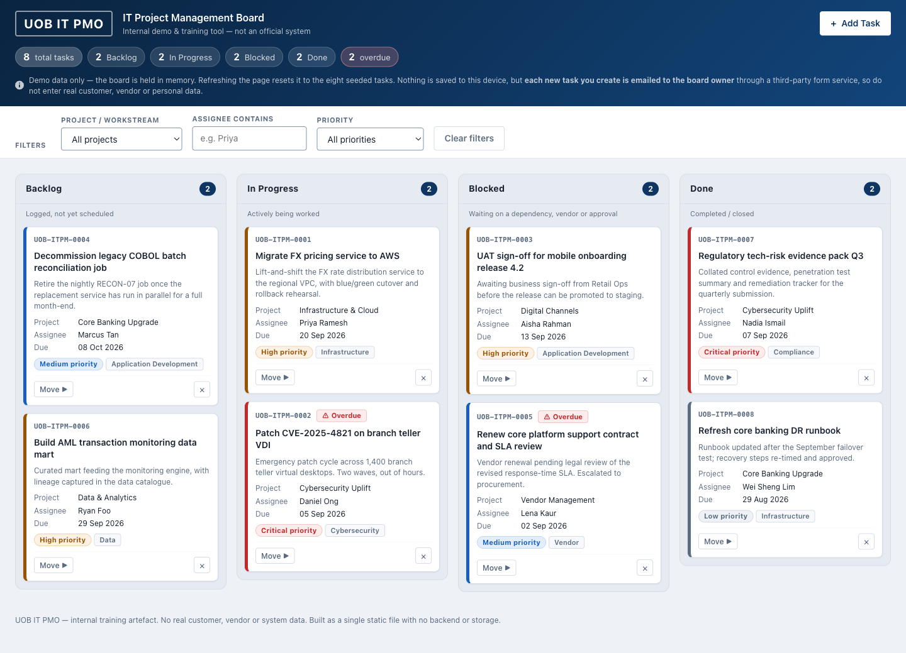
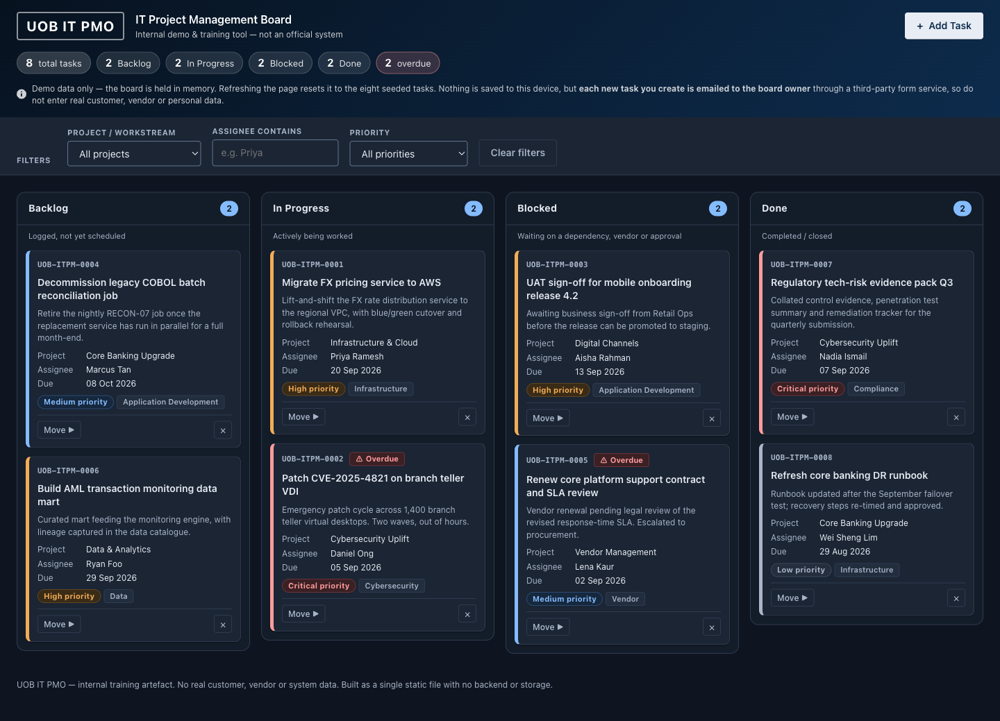
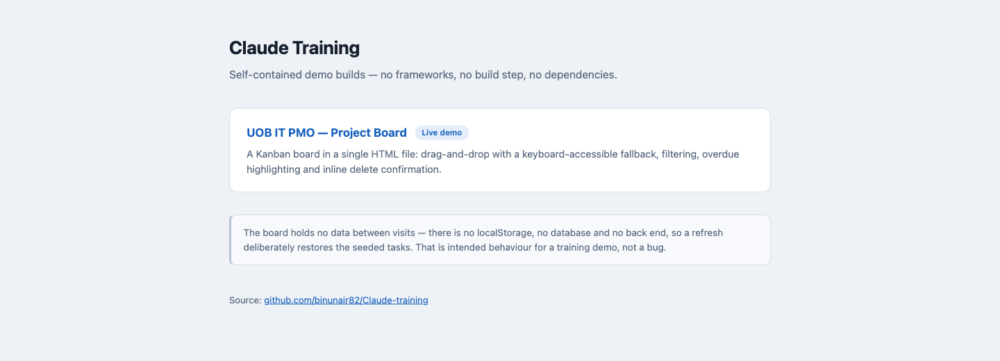

# Claude Training

Self-contained demo builds used for Claude Code training — no frameworks, no build
step, no dependencies. Every page is plain HTML, CSS and JavaScript that runs by
double-clicking the file.

**Live site:** https://binunair82.github.io/Claude-training/

## Screenshots

The Kanban board at [/VSCODE/](https://binunair82.github.io/Claude-training/VSCODE/),
which follows the operating system's light or dark setting:





The landing page at the repository root:



## What's inside

| Path | What it is |
| --- | --- |
| `index.html` | Landing page linking to each demo |
| `VSCODE/index.html` | **UOB IT PMO Project Board** — a Kanban board in a single 1,785-line file |
| `VSCODE/CLAUDE.md` | Working notes and constraints for the board (architecture, verification recipe) |
| `.github/workflows/pages.yml` | Deploys the repository to GitHub Pages on every push to `main` |
| `docs/screenshots/` | Screenshots of the live site, captured from the deployed Pages URL |
| `skills-lock.json` | Pinned versions of the Claude Code skills this repo was built with — run `npx skills add` to reinstall them |

## The Kanban board

Live at [/VSCODE/](https://binunair82.github.io/Claude-training/VSCODE/).

- Four columns — Backlog, In Progress, Blocked, Done — seeded with 8 example tasks
- Drag-and-drop between columns, with a keyboard-accessible "Move ▶" menu as a
  fallback so the board is usable without a pointer
- Filter bar, per-column counts and a board summary
- Overdue due dates flagged on the card
- Inline "Delete? Yes / No" confirmation instead of a native `confirm()` dialog
- New-task dialog with field-level validation and ARIA error wiring
- Toast notifications through a polite live region
- Responsive: columns stack below 768px
- **Light and dark themes** — a Theme button in the header cycles
  System → Light → Dark, and System follows the operating system

### Theming

The header's **Theme** button cycles System → Light → Dark. *System* follows the
operating system's appearance setting; the other two override it in either
direction, so you can read the board in dark on a machine set to light.

The choice lives in memory and **resets on refresh**, because this file is
barred from `localStorage` (see the constraints below) — the same way the eight
seeded tasks reset, which the header already tells you.

Only design tokens are restated for dark — no component rule is duplicated —
so new UI must use a token rather than a literal colour to work in both themes.
Both palettes are contrast-measured: body text ≥ 13:1, muted text ≥ 5.4:1, every
priority pill ≥ 4.8:1, and focus rings and input borders ≥ 3:1 against whatever
sits behind them.

### Security

- A **Content-Security-Policy** meta tag pins outbound requests to the single
  FormSubmit host and gives `default-src 'none'` for everything else, so an
  injected `` or `<script src>` cannot load or beacon data out. Verified in
  a browser: FormSubmit allowed, all other hosts blocked. `'unsafe-inline'` is
  unavoidable given the one-file design, which is why the escaping below carries
  the primary load.
- Every user string passes through `escapeHtml()` before reaching `innerHTML`,
  with all attribute values quoted.
- Outbound notifications are **capped at 5 per minute** per page session, in
  memory. That is an abuse limiter, not a security control — it resets on
  refresh and cannot stop a direct POST to the endpoint.
- `frame-ancestors` is deliberately omitted: browsers ignore it in a meta tag
  and GitHub Pages cannot set response headers, so claiming clickjacking cover
  here would be false.

> [!IMPORTANT]
> **The notification address is public.** `FORMSUBMIT_ENDPOINT` holds a real
> mailbox in plaintext, committed to this repo and served on a public Pages
> site. It can be scraped by anyone reading the page source, and anyone can POST
> to that endpoint directly. Two ways to close it: point it at a dedicated
> throwaway alias you can burn, or drop the notification feature and keep the
> board fully local. The 5/minute cap only slows casual abuse through the page.

### Deliberate constraints

These are design decisions, not gaps:

- **One file.** All markup, one `<style>` block, one `<script>` block.
- **No dependencies.** No framework, bundler, CDN, web font or image file — system
  font stack, inline SVG and Unicode glyphs only.
- **No persistence.** No `localStorage`, `sessionStorage`, IndexedDB or cookies. A
  refresh restores the seeded tasks on purpose; the header says so.
- **Works from `file://`.** Opening the file directly must work.

## Running it locally

```bash
git clone https://github.com/binunair82/Claude-training.git
cd Claude-training
open index.html            # macOS; or just double-click the file
```

Serving over HTTP avoids a CORS preflight on the notification call (see below):

```bash
python3 -m http.server 8000
# then visit http://localhost:8000/
```

## Configuration

New-task notifications go through [FormSubmit](https://formsubmit.co). The address
lives in a single constant near the top of the script block in `VSCODE/index.html`:

```js
const FORMSUBMIT_ENDPOINT = "https://formsubmit.co/ajax/<your-address>";
```

Change it there and nowhere else. FormSubmit requires a one-time activation: the
first submission emails a confirmation link to that address, and nothing is
delivered until it is clicked.

Submission is optimistic — the card is added and rendered before the network call,
and a FormSubmit failure downgrades to a warning toast rather than breaking the
board. Over `file://` that failure path is exercised routinely, because the JSON
content-type triggers a CORS preflight from a `null` origin.

## Deployment

`.github/workflows/pages.yml` uploads the whole repository as the Pages artifact on
every push to `main`, so `index.html` is the landing page and the board stays
reachable at `/VSCODE/`. Pages must already be enabled with its source set to
**GitHub Actions** under Settings → Pages — the workflow's `GITHUB_TOKEN` cannot
create the Pages site itself.
